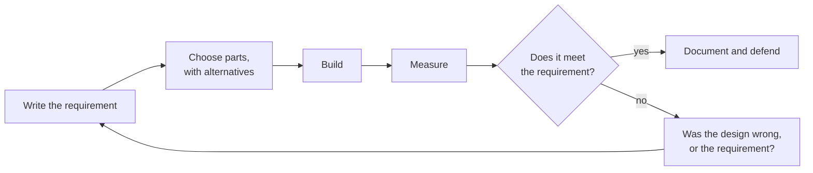
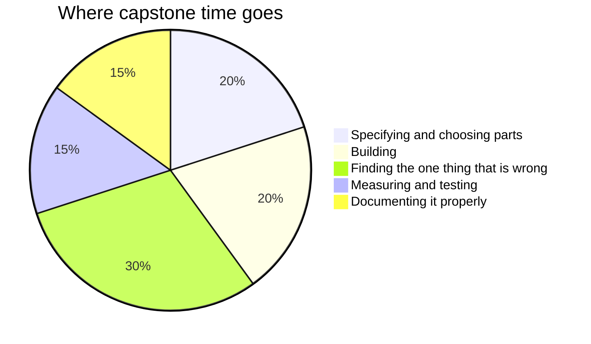
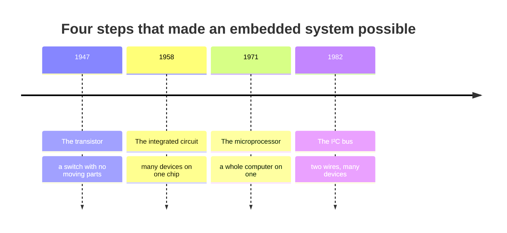

This page exists for two audiences. Students: it shows why the notes
look the way they do, and how to read them. Teachers: it is a working
reference for everything a page can contain, with the source visible in
every example.

Everything below is written in **Markdown** — plain text with a few
marks of punctuation that mean something. If you can write a text
message, you can write this.

---

## Text that carries meaning

You get **bold**, *italic*, ~~struck through~~, and ==highlighted==
text. Highlighting is the one worth knowing: it draws the eye better
than bold when a single ==key term== needs to stand out inside a
paragraph, which is why [[Which One Doesn't Belong]] uses it to mark
the vocabulary a defence has to reach for.

**How that was made:**

```markdown
**bold**, *italic*, ~~struck through~~, ==highlighted==
```

Arrows written as `->` become proper arrows: specify -> predict ->
measure -> defend.

Keyboard keys look like keys: press <kbd>⌘</kbd> + <kbd>K</kbd> to
search.

---

## Mathematics, typeset properly

This course runs on arithmetic that has to be readable, and the site
typesets it exactly. Inline, inside a sentence, like $P = I^2R$ — or
displayed on a line of its own:

$$T_J = T_A + P \times \theta_{JA} = 25\ \text{°C} + 1.4\ \text{W} \times 60\ \text{°C/W} = 109\ \text{°C}$$

Units go inside `\text{}` so they stay upright and are never mistaken
for variables — a small thing that turns out to matter every time you
write a value down. Greek letters and subscripts come free, which is
what makes a thermal or a time-constant calculation readable rather
than a row of ASCII.

**How that was made:** single dollar signs keep an expression inside
the sentence; double dollar signs give it a line of its own.
[[Power and Regulation Practice]] and
[[Sampling and Resolution Practice]] lean on this constantly.

---

## Code, coloured and exact

This is the feature an embedded-systems course lives on: runnable
examples with spacing and quotation marks preserved, coloured by
meaning.

```python
from machine import Pin
import time

# Pin 15 here is an example only — check your own board's pinout
# diagram, because the numbering differs between boards.
heater = Pin(15, Pin.OUT)

IDLE = "idle"
HEATING = "heating"

setpoint = 22.0
hysteresis = 0.5
state = IDLE


def read_temperature():
    # Replace this with a real sensor read on your own hardware.
    return 21.0


while True:
    temperature = read_temperature()

    if state == IDLE:
        if temperature < setpoint - hysteresis:
            state = HEATING
    elif state == HEATING:
        if temperature > setpoint + hysteresis:
            state = IDLE

    if state == HEATING:
        heater.value(1)
    else:
        heater.value(0)

    time.sleep(0.5)
```

**How that was made:** three backticks and the language name, the code,
then three backticks to close it. Every page in
[[Code/index|the Code folder]] uses this.

---

## Headings, and the table of contents

Every `##` heading on a page becomes a link in **Navigate this page**,
over on the right — built automatically from the headings, so it can
never fall out of step with the page. Deeper headings nest underneath.

A short page reads better without a contents panel, and one frontmatter
line (`enableToc: false`) turns it off. Every class page in
[[All Classes/index|All Classes]] does exactly that: an agenda of six
items does not need navigating.

---

## Callouts

Callouts lift something out of the flow of the page, each kind with its
own colour and icon.

> [!note] Note
> Neutral information worth setting apart.

> [!tip] Tip
> A shortcut, a habit, or something that makes the work easier.

> [!important] Important
> The one thing to take away if you take away nothing else.

> [!warning] Warning
> Where people usually go wrong. Tolerance traps, unit-prefix errors,
> and datasheet conditions live in these boxes.

> [!danger] Danger
> Where somebody could actually get hurt. Used sparingly, and every
> time it appears it means it.

> [!question] Question
> Something to think about rather than something to know.

> [!abstract] At a glance
> Used at the top of task pages for format and timing.

**How that was made:** a blockquote with the kind named in brackets.

```markdown
> [!warning] Where people usually go wrong
> The text of the callout goes here.
```

### Foldable callouts

Add a `-` after the kind to start a callout collapsed. Every practice
set hides its worked answers this way — commit to your own number
first, then open it:

> [!success]- Worked answer
> A linear regulator dropping 7 V at 200 mA dissipates 1.4 W. With a
> junction-to-ambient thermal resistance of 60 °C/W, the junction sits
> about 84 °C above ambient — comfortable on a 25 °C bench and over
> the limit in a sealed box at 45 °C. If you answered "it is within
> the rating", reread
> [[Reliability and Derating#Rated is not the same as safe]].

```markdown
> [!success]- Worked answer
> The hidden solution.
```

---

## Diagrams

Diagrams here are **written, not drawn** — editable in seconds, and
never needing a graphics program.



**How that was made:**

````markdown

````

Proportions draw themselves too:



And history fits on a line:



---

## Tables

**How that was made:** rows of text separated by `|`, with a line of
dashes under the headings. Mathematics works inside cells, which
matters more here than it sounds.

| Quantity | Symbol | Unit | Measured how |
| --- | --- | --- | --- |
| Voltage | $V$ | volt (V) | Meter in parallel, across the part |
| Current | $I$ | ampere (A) | Meter in series, or across a sense resistor |
| Power | $P$ | watt (W) | Calculated, then confirmed by temperature |
| Rise time | $t_r$ | second (s) | Scope, 10 % to 90 %, with the instrument's own limit subtracted |

> [!warning] Piped links inside a table cell need their pipe escaped
> A link like `[[Getting Unstuck\|the method]]` needs a backslash
> before the pipe when it sits in a table, because the table is
> already using `|` to mean "next column". Outside a table it does
> not: [[Getting Unstuck|the method]].

---

## Checklists

**How that was made:** a list where each line starts with `- [ ]`, or
`- [x]` for one already done.

- [x] Current limit set before the leads went on
- [ ] Requirement written down, with a threshold that could fail
- [ ] Prediction written down, with units and conditions
- [ ] Probe compensated, ground spring fitted
- [ ] Somebody else could build this from your documentation

They are clickable in the browser and nothing is saved — but they are
how [[Bench Power Supply Habits]] and
[[Writing Documentation Somebody Can Build From]] turn from advice into
habit.

---

## Links between pages

This is what makes the site more than a pile of documents.

- A plain link: [[Reliability and Derating]]
- A link with different words:
  [[Reliability and Derating|the margin you leave on purpose]]
- A link to a section:
  [[Reliability and Derating#Rated is not the same as safe]]

**How that was made:** double square brackets.

```markdown
[[Reliability and Derating]]
[[Reliability and Derating|different words for the link]]
[[Reliability and Derating#Rated is not the same as safe]]
```

### Transclusion — one page inside another

**How that was made:** `![[Page name]]` — a link with an exclamation
mark in front of it. Here is the help sessions page, embedded live
rather than copied:

![[Help Sessions]]

Change the source page and every page that embeds it updates. That is
how the same information appears in several places without anybody
maintaining duplicates, and without any of the copies going stale. It
is the same principle as a single source of truth in your own
documentation, and for the same reason.

### Backlinks

Scroll to the bottom of any page and you will find **Backlinks** —
every page that links *to* this one, gathered automatically. Open
[[Using an Oscilloscope Properly]] and its backlinks list every page
that assumes you can drive one. Nobody maintains that list, and it is
never wrong.

---

## Hover previews

Hover over [[Using a Logic Analyzer]] without clicking. The page
appears in a small window. Checking one setting or one definition in
the middle of a calculation does not cost you your place in the
calculation.

---

## Footnotes

**How that was made:** `[^1]` where the marker goes, and a matching
`[^1]:` line anywhere in the page.

The rule that governs every digital sample you take was worked out
before anybody had a computer to apply it to.[^1]

[^1]: The relationship between how fast you sample and what you can
    faithfully recover was described in telegraph engineering in the
    1920s and given its formal information-theory footing in the
    1940s, decades before the first microcontroller. That is a
    recurring pattern worth noticing: the theory usually arrives
    first, and the parts catch up.

---

## Tags

**How that was made:** a `tags` list in the frontmatter at the very top
of the page.

```yaml
---
tags:
  - concepts
  - unit-1
---
```

Every tag becomes a page listing everything filed under it.

---

## What you cannot see

Two things on this page are invisible in the browser.

1. **Comments.** Text wrapped in `%%` double percent marks `%%` never
   reaches the site. Useful for notes to yourself inside a page you are
   still writing — tomorrow's hint, next year's fix.
2. **Drafts.** A page with `draft: true` in its frontmatter is skipped
   entirely when the site is built. Write next week's lesson today and
   publish it when you are ready.

%% This sentence is a comment. If you can read it on the site, something is broken. %%

> [!tip] For teachers reading this
> With more than one section, per-section keys such as `draftSection1`
> and `draftSection2` let a single shared page be published to one
> class and held back from another — useful when two sections sit a few
> days apart in the schedule.

---

## The point of all this

None of it is decoration. Each feature removes a reason for a page to
go out of date, or a reason for a student to be looking at something
less useful than the real thing.

| Feature | The problem it solves |
| --- | --- |
| Typeset mathematics | Formulas retyped as plain text and misread |
| Coloured code | Screenshots of code nobody can copy or run |
| Transclusion | The same text copied into six places, five of them stale |
| Backlinks | "Where did we use this again?" |
| Folded answers | Solutions that spoil the attempt |
| Drafts | Next week's lesson living in a file somewhere else |

Write it once, link to it everywhere. That is also, precisely, the
advice in [[Writing Documentation Somebody Can Build From]].
