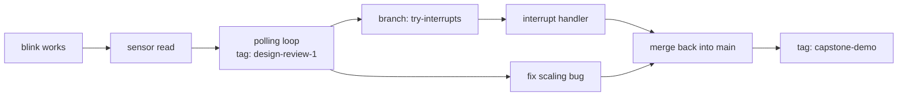

Here is a folder that exists on every student laptop in the country:
`main.py`, `main_v2.py`, `main_v2_works.py`, `main_final.py`, and
`main_final_ACTUAL.py`. Nobody can say which one was on the board at
the demonstration, what changed between any two of them, or how to get
back to the version that worked before Thursday.

A version control system fixes exactly that, and it is not a
programmer's luxury — it is the answer to a question this course asks
you constantly: *which version, under what conditions?* We use **git**,
the same tool used to build the operating system on your phone.

## The five ideas

Everything else is detail.

| Idea | What it actually is |
| --- | --- |
| Repository | Your project folder plus the complete history of every change ever committed to it |
| Commit | A snapshot of the whole project at one moment, with an author, a time, a message, and a link to the commit before it |
| Branch | A movable name pointing at a commit — a line of work you can develop without disturbing another |
| Merge | Bringing the changes from one branch into another |
| Tag | A fixed name attached permanently to one commit — the thing you use to mark "this is what was on the board" |

The commit is the load-bearing idea. Because each commit records its
parent, the history is a chain, and any commit in it can be recovered
exactly. Nothing is ever lost by editing a file; it is lost only by
never committing in the first place.

The commands that do the daily work are few. `git status` says what has
changed. `git add` chooses what goes into the next snapshot.
`git commit -m "…"` takes it, with a message. `git log --oneline` shows
the history. `git diff` shows precisely what changed, line by line.
`git branch` and `git switch` make and move between lines of work.
`git merge` brings them back together. `git tag` marks a commit
permanently. A repository copied somewhere else is a **remote**, and
`git clone`, `git pull`, and `git push` move history between copies.

## A history with a branch in it

Read it left to right. Work proceeds along the main line. At the
design review, a tag is planted so that exact state can always be
recovered. Then two things happen at once: a bug gets fixed on the main
line, while a risky experiment — moving from polling to interrupts —
happens on its own branch where it cannot break anything. When the
experiment works, it merges back. When it does not, the branch is
deleted and nothing was harmed.

That last sentence is the whole argument for branches. A branch is
permission to try something dangerous.

## The firmware discipline

Version control for embedded work has requirements that a pure software
project does not, because your code is only half of the system.

- **Tag the commit that produced the binary on the board.** When
  somebody reports a fault at a design review, "which firmware was
  running?" must have an exact answer. A tag makes it one command to
  recover. Without one you are guessing, and a bug report against
  unknown code is not a bug report.
- **Record the toolchain with it.** The same source on a different
  MicroPython build can behave differently. Write the firmware version
  into your documentation, or into a constant in the code itself, so
  the running device can tell you what it is.
- **Write messages that say why.** The diff already shows *what*
  changed. "Increase debounce to 30 ms — bounce measured at 18 ms on
  the scope, see journal entry" is a message that saves somebody an
  hour. "update" is a message that saves nobody anything.
- **Commit small and often, and leave it working.** Each commit should
  be a state where the code at least runs. Then, when something breaks,
  you can walk backwards through a handful of small changes instead of
  one enormous one.
- **Never commit secrets.** Wi-Fi passwords, API keys, anything
  personal. Put them in a configuration file, exclude that file from
  the repository with a `.gitignore` entry, and commit an example file
  with the fields blank so the next person knows what is needed. A
  secret committed once stays in the history even after you delete it.
- **Keep generated files out.** Compiled binaries and build output do
  not belong in the history. They are large, they change every build,
  and they are reproducible from the source that is already there.

> [!tip] Binary search over your own history
> Git can automate the halving method you already use on a circuit.
> `git bisect` asks you to mark one commit as good and one as bad, then
> checks out the midpoint and asks which it is. Ten questions can
> pinpoint the exact change that introduced a fault among a thousand
> commits. It is the same method as splitting a signal path in half in
> [[Getting Unstuck]] — applied to time instead of copper — and it
> only works if your commits are small and each one runs.

## What version control does not know

Being clear about the limits is part of using it well.

- **It tracks text well and binaries badly.** Source, configuration,
  and documentation written as text all work beautifully. Images and
  compiled output do not, because git cannot describe what changed
  inside them.
- **It does not know your hardware revision.** The board you flashed
  is not in the repository. Which revision of the schematic this
  firmware matches belongs in your documentation, tied to the tag —
  see [[Writing Documentation Somebody Can Build From]].
- **It is not a backup on its own.** A history that exists only on one
  laptop dies with the laptop. Push it somewhere else, or copy it.
- **It cannot make a bad commit message good later.** The moment you
  know why you made a change is the moment you write it down. Ten
  minutes afterwards, you already do not remember.

Used properly, the payoff arrives on the worst day of your capstone:
the demonstration is in two days, the firmware that worked last week
does not work now, and you can recover last week exactly, see the
seventeen lines that changed, and know within minutes which one did it.
That is not tidiness. That is the difference between a bad afternoon
and a lost project.

%%curriculum-start%%
## Curriculum connection

![[B5.1]]

![[D3.4]]
%%curriculum-end%%
