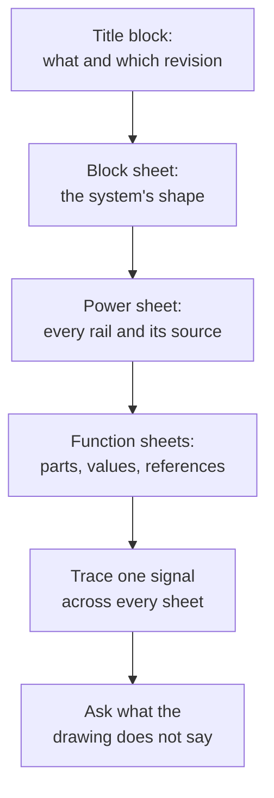

Last year a drawing went up — five to fifteen components, values
marked — and you read it aloud the way you would read a paragraph:
rails first, then ground, then one loop at a time. Keep that. It is
the foundation and it does not change.

What changes this year is the drawing. Real designs do not fit on one
sheet, and once a schematic has pages, the hard part stops being
"which node is this?" and becomes **"where does this signal go, and
who else is holding it?"** A drawing that spans four sheets can hide a
connection in plain sight, and it can hide the absence of one just as
easily.

## How to run it

1. Show one sheet of a multi-sheet drawing, or a block sheet with its
   children named. Two quiet minutes.
2. One student reads the **title block** aloud: what this sheet is,
   what revision it is, and whether the drawing says anything about
   what changed. Nobody used to bother. It is the first thing a
   working technician looks at.
3. A second student names the sheet's inputs and outputs — every
   signal that arrives from or departs to somewhere else.
4. A third traces one signal from where it enters this sheet to
   everywhere it goes, out loud, including the places it goes that are
   not on this page.
5. The class asks one question the drawing does not answer. There is
   always one. Finding it is the skill; on Grade 12 drawings it is
   often a question about a *return path* or a *timing relationship*.

## The reading order

Same discipline, one level up. The order is not arbitrary — it is the
order that makes everything after it make sense.

Title block first, because a drawing you cannot identify is a rumour.
Block sheet second, because it tells you which sheet to open. Power
next, because every other voltage on every other page is measured
against a ground and fed from a rail defined here. Then the function
sheets, and only then a signal traced end to end.

## Following a signal across sheets

Three mechanisms carry a connection from one page to another, and they
look nothing alike.

| Mechanism | What it means | Where it bites |
| --- | --- | --- |
| Net label | Two points with the same name are the same node, with no wire drawn | A typo in a name silently splits one net into two |
| Off-page or hierarchical port | A named connection that leaves this sheet for a stated destination | The port exists on one sheet and not on the other |
| Power symbol | Implies connection to a rail defined elsewhere | Two rails with similar names, only one of them real |

None of these is visible as a wire. That is the whole point of them —
without net labels a four-sheet drawing would be unreadable — but it
means the drawing's connectivity is carried by *text*, and text can be
wrong in ways a line cannot. When a design review asks "are you sure
these are the same net?", this is the question being asked.

Watch also for the annotations that are not connections at all:
a `DNP` note meaning the part is on the drawing but deliberately not
fitted, an alternate part listed beside a component, a pin marked `NC`
that must be left unconnected rather than tied anywhere convenient.
Every one of those is a decision somebody made, and
[[Writing Documentation Somebody Can Build From]] is where you learn
to record yours the same way.

## What the drawing still is not telling you

A schematic shows connections, never positions — that was true last
year and it is still true. At Grade 12 the omissions start to matter
in specific, expensive ways.

- **The return path.** The drawing shows a single symbol for ground.
  The board has copper, and current comes back through it by some
  route the schematic does not describe. Where that route runs decides
  whether your sensor reading moves when the motor starts.
- **Physical placement.** A decoupling capacitor drawn beside its chip
  and fitted 40 mm away is doing far less than the drawing implies.
- **Thermal reality.** Nothing on a schematic is hot. Plenty of things
  on the board are.
- **Timing.** Two signals drawn side by side say nothing about which
  arrives first. That question belongs to [[Read the Waveform]] and to
  an instrument.

## One variation

Give two benches the same block sheet and different function sheets,
and have them work out together whether the interface between their
two sheets actually agrees — signal names, voltage levels, direction,
and who provides the pull-ups. This is exactly the conversation two
engineers have on a real project, it is the conversation
[[The Interface]] is built around, and it fails in the same way every
time: both sides assumed the other one was driving the line.

> [!tip] Read the drawing of something already on your bench
> The best round of this routine uses sheets from a design the class
> has already built. Reading a drawing whose behaviour you remember is
> how symbols stop being symbols — and it is the cheapest rehearsal
> for the day a four-sheet drawing arrives for something you have
> never seen, which is what most of a technical career looks like.
