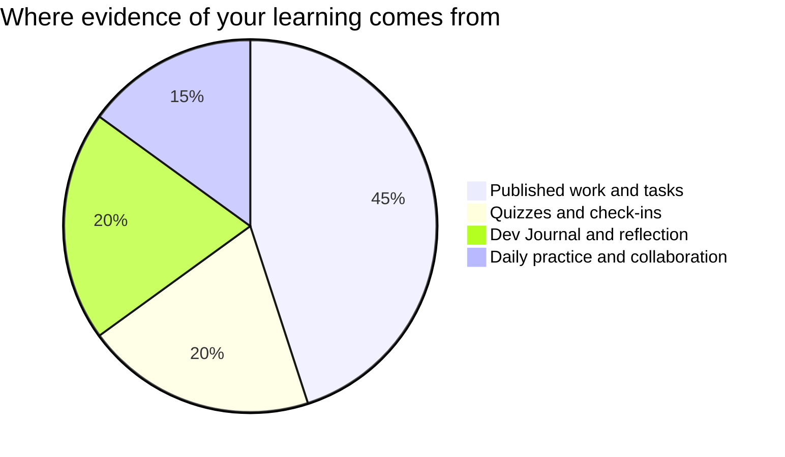

Marks in this course worry people for one wrong reason: the belief that
some people are "naturals" — born writers, born photographers — and
the rest should hold the tripod. No such split exists — reporting,
shooting, editing, and designing are learned crafts, and you are
marked on **process, growth, and communication**, all inside your
control.

## Where evidence comes from

**Published work** is the pages in Tasks — each lists its success
criteria before you start, phrased as things a reader could see. A
flashy package with unverified names scores lower than a modest one
that is accurate, consented, and credited, because
[[Our Newsroom Standards|standards]] are most of the craft.

**Quizzes** are short, frequent, low-stakes, and re-attemptable after
new learning — they exist to find out what needs work, not to close the
book on it.

**Reflection** is your [[Newsroom Journal]]. It is where a spiked
story or a blurry contact sheet turns into evidence of learning —
often the strongest evidence you have.

**Daily practice** is the small stuff done consistently: warm-up
judgement calls, fair teamwork on shoots, deadlines kept, the edit
that made a teammate's story better.

> [!important] First drafts are never penalised as first drafts
> Version one of everything gets edited — that is what editors are
> for. The mark follows where your work ends up and how visibly you
> got there; the journal and your revision notes are how "visibly"
> happens.

If a mark ever surprises you, ask — the criteria on each task page are
the whole story, and [[Getting Help]] lists the ways to reach me.

%%curriculum-start%%
## Curriculum connection

![[B1.2]]
%%curriculum-end%%
