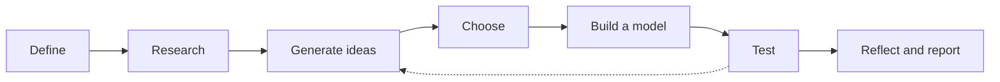

A client says the bank behind their house is washing into the water and
asks you to fix it. That is not a task; it is a problem. A task has one
right answer and you get on with it. A problem has several possible
answers, constraints you have not found yet, and a customer whose real
requirement is not the one they stated first. The design process is how
the trades handle the second kind.

## The steps

The dotted line is the honest part. Any step can be revisited, and on a
real site most of them are — you find a buried drain line halfway
through and go back to research.

## What each step looks like on our sites

- **Define.** Write what is happening as observations, not conclusions.
  "Bare soil on a two-metre slope, gullies after rain, mown to the
  water's edge" beats "erosion problem".
- **Research.** Constraints before solutions. Budget? Who owns the land?
  What will grow here? Does work near water need approval? Use
  [[Where to Find Out]].
- **Generate.** Sketch three different approaches, not three versions of
  one. [[Reading a Working Drawing]] teaches the symbols you will need.
- **Choose.** Decide against criteria written down in advance — cost,
  durability, maintenance, appearance, time.
- **Build a model.** A scale plan, a layout staked out on the ground, a
  mock-up in the shop. A model exists to be wrong cheaply.
- **Test and evaluate.** Ask the client, not only yourself, and measure
  it using [[Measuring and Marking]].
- **Reflect and report.** Write what you would do differently.

The cycle is what [[The Site Project]] runs on. Smaller faults get
smaller methods — swapping a part until a mower runs, or halving a
problem until each piece is simple enough to solve.

%%curriculum-start%%
## Curriculum connection

![[A3.1]]

![[A3.2]]
%%curriculum-end%%
