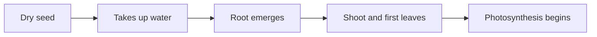

A plant is a slow machine that runs on light, water and air. Four
processes keep it going, and every growing decision in this course is
really a decision about one of them — when to sow, how much to water,
when to harvest, whether to shade a bench in July.

## Germination — waking up

A dry seed is alive but shut down. Give it water, warmth and oxygen and
it starts again: it takes up water and swells, stored food becomes
usable energy, the root breaks out first to find more water, and only
then does the shoot push toward the light.

Until those first true leaves open, the seedling is spending a fixed
amount of stored energy and cannot earn any more. That is why a seed
sown too deep never appears — it ran out before it reached the surface.
See [[Propagation From Seed]].

## Photosynthesis — earning

In the leaves, light energy combines carbon dioxide from the air with
water from the roots, producing sugar and releasing oxygen. Sugar is the
plant's income. Everything else — new leaves, new roots, flowers, fruit,
thickening wood — is bought with it.

## Respiration — spending

Respiration runs the other way: sugar and oxygen are broken down to
release energy, giving off carbon dioxide and water. It happens in every
living cell, day and night, and speeds up as things get warmer. Growth
is what is left when income beats spending. A plant in the dark still
respires, which is why it starves rather than merely stalls — and why
warmth after harvest is expensive, as
[[Harvest and What Happens Next]] explains.

## Reproduction — making the next one

Sexual reproduction runs pollen to a receptive flower, producing seed
that mixes two parents. Vegetative reproduction takes a piece of one
parent and grows a genetically identical plant. The trade uses both on
purpose: seed for variety and volume, cuttings when the customer wants
exactly the plant they saw. Run all four against your own plants in
[[The Growing Trial]] — if a trial plant is not growing, one of these
four is blocked, and your job is to say which.

%%curriculum-start%%
## Curriculum connection

![[A1.3]]
%%curriculum-end%%
