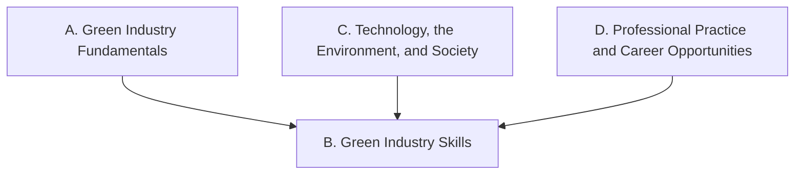

Everything this course does points at one or more of these expectations,
from **THJ2O — Green Industries, Grade 10, Open**. Every technique,
growing job, and task links back to the codes it addresses.

> [!info] Where these come from
> The wording below is the Ontario curriculum's own, from the 2009
> technological education document — the only one that ever defined
> THJ2O. The Ministry's 2024 curriculum supersedes it, so check what
> your board offers before planning a year from these codes. See
> [[About These Expectations]].

None of these four is a *throughout this course* strand — every stem in
the document reads *by the end of this course* — but only strand B puts
hands on the work. Strand A explains what a plant or an animal needs,
strand C places that work in an environment and a community, and strand
D covers working safely and the careers the skills lead to. Strand B is
where a student does the job.

## Overall and specific expectations

### Strand A. Green Industry Fundamentals
*By the end of this course, students will:*

![[A1. Basic Biology]]
![[A1.1]]
![[A1.2]]
![[A1.3]]
![[A2. Factors Affecting Growth]]
![[A2.1]]
![[A2.2]]
![[A2.3]]
![[A3. Designs, Processes, and Systems]]
![[A3.1]]
![[A3.2]]
![[A3.3]]
![[A3.4]]
![[A4. Technological and Mathematical Literacy and Communication Skills]]
![[A4.1]]
![[A4.2]]
![[A4.3]]

### Strand B. Green Industry Skills
*By the end of this course, students will:*

![[B1. Design and Production]]
![[B1.1]]
![[B1.2]]
![[B1.3]]
![[B1.4]]
![[B2. Technical Skills]]
![[B2.1]]
![[B2.2]]
![[B2.3]]

### Strand C. Technology, the Environment, and Society
*By the end of this course, students will:*

![[C1. Technology and the Environment]]
![[C1.1]]
![[C1.2]]
![[C2. Technology and Society]]
![[C2.1]]
![[C2.2]]
![[C3. Local Industries]]
![[C3.1]]
![[C3.2]]
![[C3.3]]

### Strand D. Professional Practice and Career Opportunities
*By the end of this course, students will:*

![[D1. Health and Safety]]
![[D1.1]]
![[D1.2]]
![[D1.3]]
![[D1.4]]
![[D1.5]]
![[D2. Career Opportunities]]
![[D2.1]]
![[D2.2]]
![[D2.3]]
![[D2.4]]
![[D2.5]]
![[D2.6]]
