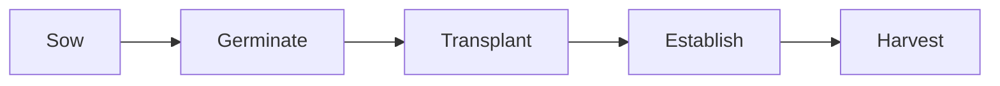

A short tour of what these pages hold — partly so you can read them, and
partly so a teacher taking this course over can write them.

## Tables

Most of what this course needs to compare fits a table.

| Propagation method | Best for | Watch for |
| --- | --- | --- |
| Seed | Large numbers, cheaply | Variability between plants |
| Cuttings | Plants identical to the parent | Rot, and drying out before roots form |

A link inside a table cell needs its pipe escaped, or the cell breaks:
write `[[Propagation From Seed\|sowing]]` and it renders as
[[Propagation From Seed\|sowing]].

## Callouts

> [!tip] A tip
> Something to do differently tomorrow.

> [!warning] A warning
> Safety, or a mistake that costs a crop. Said loudly on purpose.

A callout with a `-` after its type starts folded:

> [!success]- A folded block
> Used for check-yourself questions, so you get to think first.

## Diagrams

Written as text, so they can be edited without a drawing program:



## Checklists

- [ ] Boots, gloves, water
- [ ] Read the safety page for today

> [!warning] These do not save
> A checkbox here is printed, not interactive. Nothing is recorded.
> Copy the list into your record.

## Numbers and money

Amounts are ordinary text — \$14, \$2,300 — and the backslash matters:
without it the dollar sign can start a mathematics span and swallow the
rest of the sentence. You will cost real jobs in this course, so it comes
up.

## What this course does not use

The site can typeset mathematics and highlight program code, and this
course does neither. Shown once so you know they exist:

$$\text{area} = \text{length} \times \text{width}$$

```python
print("not used in this course")
```

Your calculations happen on paper and in a spreadsheet, where a
supplier's quantities can be checked.
