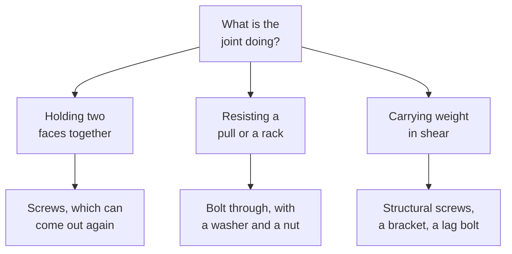

Everything you build in this course lives outside. Outside means rain
soaking into end grain, sun splitting the top edge, frost lifting
anything set on soft ground, and a hundred wet-dry cycles a year working
every joint loose. A build that would last a decade indoors can fail in
two seasons in a garden bed.

## Choosing the material

Untreated softwood in contact with soil is a two-year plan.
Pressure-treated lumber, cedar, and composite boards are the usual
answers for beds, benches, and edging, and each has a cost and a
trade-off you should be able to state out loud. Either way: cut ends are
the weak point, because end grain drinks water, so seal them or keep them
out of the soil — and keep wood off the ground wherever the design
allows.

## Choosing the fastener

Fasteners fail outdoors in one of two ways. They corrode, so outdoor work
wants hot-dip galvanised or stainless steel, and pressure-treated lumber
is especially hard on plain steel. Or they let go, which is a design
question:

Nails hold well in shear and poorly in withdrawal, which is why deck
boards are screwed and framing is nailed. Screws want a pilot hole near
an end or an edge, or the wood splits and the joint was never made.

## Joining so it lasts

- **Design so water runs off, not in.** Slope the top of a rail, gap the
  deck boards, and never make a pocket that holds a puddle.
- **Triangles do not rack.** Four boards in a rectangle lean over
  eventually; a diagonal brace or a proper bracket is what stops it.
- **Clamp before you fasten.** A joint pulled together by the screw alone
  is a joint with a gap in it.
- **Check square as you go**, using the diagonals from
  [[Measuring and Marking]] — not at the end, when nothing can be fixed.

An outdoor build is finished when somebody else can look after it, so
write down what you used and what it will need. That record is part of
[[The Shop Build]] and the point of [[The Site Project]];
[[Writing a Work Record]] shows the shape it takes.

%%curriculum-start%%
## Curriculum connection

![[B2.2]]
%%curriculum-end%%
