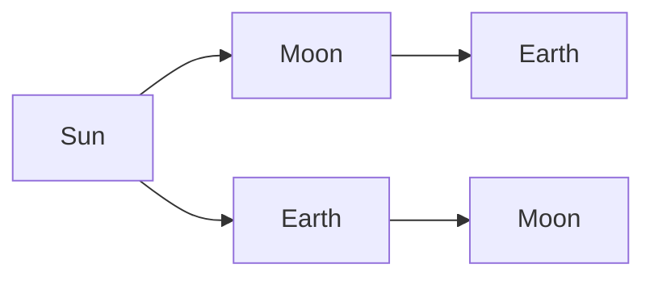

## The idea

Seasons, phases, eclipses, and tides all follow from geometry — the relative
positions of Sun, Earth, and Moon.

## Seasons come from tilt, not distance

Earth's axis is tilted $23.5^\circ$. In June the northern hemisphere leans
toward the Sun: light arrives more directly and days are longer.

> [!warning] The number one misconception in astronomy
> Earth is actually **closest** to the Sun in early January. If distance caused
> seasons, both hemispheres would have summer at the same time. They do not.
> Tilt is the answer.

## Phases of the Moon

| Phase | Moon's position | What you see |
| --- | --- | --- |
| New | Between Earth and Sun | Nothing — lit side faces away |
| First quarter | 90° along the orbit | Right half lit |
| Full | Opposite the Sun | Fully lit |
| Third quarter | 270° along | Left half lit |

The Moon is always half lit. What changes is **how much of the lit half we can
see from here**.

## Eclipses

- **Solar eclipse** — Moon between Sun and Earth (only possible at new moon)
- **Lunar eclipse** — Earth between Sun and Moon (only at full moon)

> [!question] So why not one of each every month?
> The Moon's orbit is tilted about $5^\circ$ from Earth's. Most months the
> shadow misses. Eclipses need the alignment to be nearly perfect — which is why
> they are worth travelling to see.

## Curriculum

- ![[E2.6]] — [[E2.6]]
- ![[E2.2]] — [[E2.2]]
