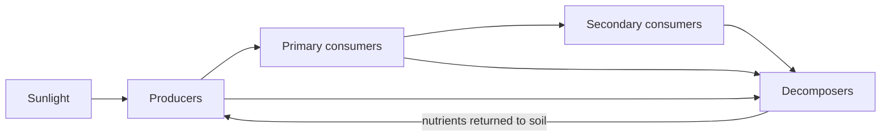

## The idea

An **ecosystem** is every living thing in a place, plus the non-living things
they depend on, plus all of the interactions between them. A rotting log is an
ecosystem. So is Lake Ontario. So is the planet.

We call the living parts **biotic** and the non-living parts **abiotic**.

| Biotic | Abiotic |
| --- | --- |
| Maple trees, deer, mushrooms | Sunlight, temperature, rainfall |
| Bacteria in the soil | Soil pH, dissolved oxygen |
| You, right now | The air you are breathing |

## Sustainability is about staying in balance

An ecosystem is **sustainable** when it can keep going indefinitely — the
resources being used are replaced about as fast as they are consumed.

Notice that "in balance" does not mean "unchanging". Populations rise and fall,
fires burn, floods come. The word scientists use is **dynamic equilibrium**:
the system wobbles around a stable state instead of running away from it.

> [!tip] A useful test question
> When something disturbs this ecosystem, does it tend to come **back**, or does
> it tend to keep **going**? Coming back is dynamic equilibrium. Keeping going
> is what we mean when we say an ecosystem has been pushed past a tipping point.

That loop at the bottom is the important part. Energy flows *through* an
ecosystem and leaves as heat. Matter **cycles** and gets used again.

## Curriculum

- [[B2.1]] — ![[B2.1#^text]]
- [[B2.2]] — ![[B2.2#^text]]
- [[B2.4]] — ![[B2.4#^text]]
