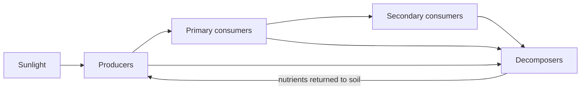

## The idea

An **ecosystem** is every living thing in a place, plus the non-living things
they depend on, plus all of the interactions between them. A rotting log is an
ecosystem. So is Lake Ontario. So is the planet.

We call the living parts **biotic** and the non-living parts **abiotic**.

| Biotic | Abiotic |
| --- | --- |
| Maple trees, deer, mushrooms | Sunlight, temperature, rainfall |
| Bacteria in the soil | Soil pH, dissolved oxygen |
| You, right now | The air you are breathing |

## Sustainability is about staying in balance

An ecosystem is **sustainable** when it can keep going indefinitely — the
resources being used are replaced about as fast as they are consumed.

Notice that "in balance" does not mean "unchanging". Populations rise and fall,
fires burn, floods come. The word scientists use is **dynamic equilibrium**:
the system wobbles around a stable state instead of running away from it.

> [!tip] A useful test question
> When something disturbs this ecosystem, does it tend to come **back**, or does
> it tend to keep **going**? Coming back is dynamic equilibrium. Keeping going
> is what we mean when we say an ecosystem has been pushed past a tipping point.

That loop at the bottom is the important part. Energy flows *through* an
ecosystem and leaves as heat. Matter **cycles** and gets used again.

## Practices that keep the cycles going

Sustainability is not only a thing to want. It is a set of practices, and
several of them are old.

| Practice | What it does to the cycles |
| --- | --- |
| Composting food and yard waste | Returns carbon and nitrogen to soil instead of sending them to landfill, where they leave as methane |
| Crop rotation, and planting legumes | Puts nitrogen back into soil biologically, so less has to be manufactured |
| The Three Sisters — corn, beans, and squash grown together | Haudenosaunee agriculture in which the beans fix nitrogen, the corn gives the beans a stalk, and the squash shades out weeds and holds soil moisture |
| Cultural burning | Deliberate low-intensity fire, used by many First Nations, that returns nutrients to soil, clears fuel that would otherwise feed a catastrophic fire, and encourages the plants people and animals depend on |
| Protecting wetlands | Holds water and stores carbon that drainage would release |

The last two are worth sitting with. Cultural burning was banned across
much of Canada for most of a century, and fire agencies are now asking
the nations who practised it to teach it again — because the ecological
case for it turned out to be sound. That is a scientific finding and a
piece of history at the same time.

> [!note] Whose knowledge this is
> Cultural burning and Three Sisters agriculture are Indigenous
> knowledge, held by specific nations, developed over generations of
> observation on specific land. When you write about them, name the
> nation where you can, and say where you learned it — the same
> citation practice you would use for any other source.
> **Robin Wall Kimmerer**, a botanist and member of the Citizen
> Potawatomi Nation, writes about this in *Braiding Sweetgrass* (2013),
> including the principle she calls the Honourable Harvest: take only
> what you need, never take the first or the last, and give something
> back.

## Curriculum connection

![[B2.1]]

![[B2.2]]

![[B2.4]]

![[B1.3]]

![[B2.7]]
