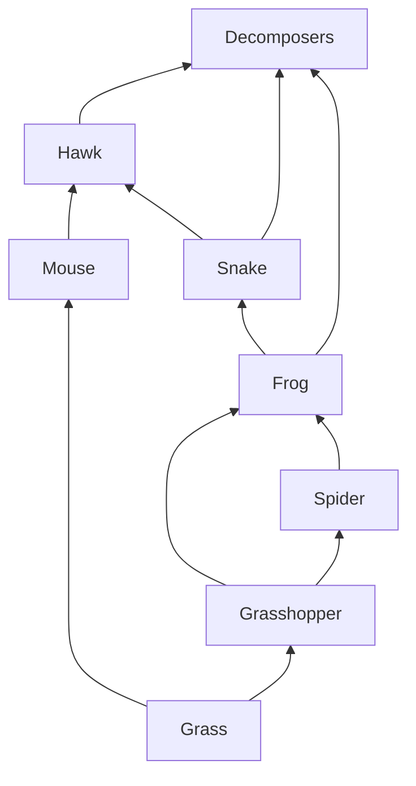

## The idea

A **food chain** is a single path: grass → grasshopper → frog → hawk. Reality is
messier, because most organisms eat several things and are eaten by several
others. Draw all of those arrows at once and you have a **food web**.

Arrows point **in the direction the energy travels** — from the eaten to the
eater. Students get this backwards constantly; the arrow is not "eats".

## Reading a web

Two questions to ask of any food web:

1. **What happens if one species disappears?** Trace every arrow leading out of
   it. Everything downstream is affected.
2. **Which species has the most arrows?** Removing that one causes the most
   disruption. Ecologists call it a **keystone species**.

> [!example] Sea otters and kelp
> Otters eat sea urchins. Urchins eat kelp. Remove the otters and the urchin
> population explodes, the kelp forest is grazed to bare rock, and every species
> that lived in the kelp goes with it. The otter never touched the kelp.

Practise this in [[Reading a Food Web]].

## Curriculum connection

![[B2.2]]

![[B2.5]]
