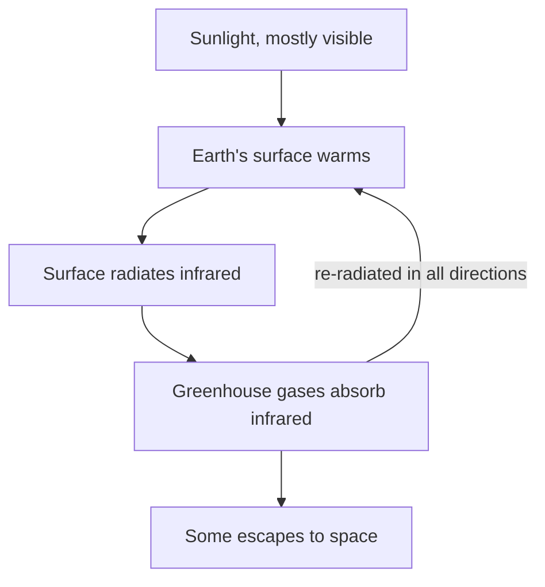

## The idea

The atmosphere lets sunlight in and slows heat on the way out. Without that,
Earth's average temperature would be about **−18 °C** instead of about
**+15 °C**. The greenhouse effect is not the problem — *strengthening* it is.

## Why the wavelength matters

Sunlight arrives mostly as visible light, which passes straight through
$\mathrm{CO_2}$. The warmed surface radiates **infrared**, which
$\mathrm{CO_2}$ and $\mathrm{CH_4}$ absorb strongly. Energy comes in easily
and leaves with difficulty — so it accumulates.

| Gas | Main human source | Relative warming per molecule |
| --- | --- | --- |
| Carbon dioxide, $\mathrm{CO_2}$ | Burning fossil fuels | 1 (the reference) |
| Methane, $\mathrm{CH_4}$ | Livestock, landfills, leaks | ~25× over a century |
| Nitrous oxide, $\mathrm{N_2O}$ | Fertiliser | ~265× |

Methane is far more potent but breaks down within about a decade;
$\mathrm{CO_2}$ is weaker and lasts for centuries. Both facts matter when
choosing what to cut first.

## Curriculum

- [[B2.6]] — ![[B2.6#^text]]
- [[B1.1]] — ![[B1.1#^text]]
