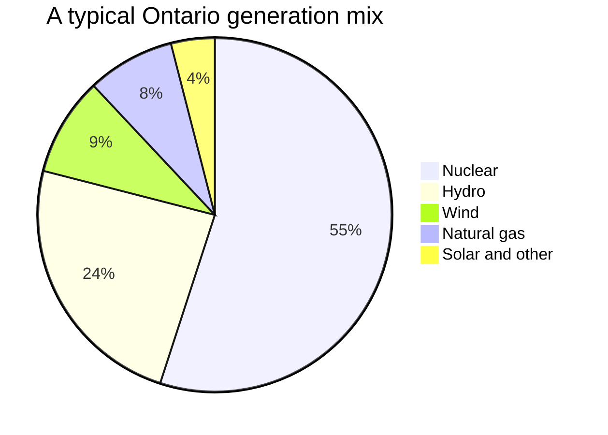

## The idea

Ontario's electricity comes from a mix of sources, and each one trades off
differently between cost, emissions, land, and reliability.

| Source | Emissions while running | Reliable output? | Main drawback |
| --- | --- | --- | --- |
| Nuclear | Very low | Yes, constant | Long-lived waste; huge build cost |
| Hydroelectric | Very low | Mostly | Floods land; disrupts rivers and fish |
| Wind | None | No — varies with weather | Needs backup or storage |
| Solar | None | No — daily and seasonal | Same, plus winter in Canada |
| Natural gas | Substantial | Yes, and fast to start | Emits $\mathrm{CO_2}$ and methane leaks |

> [!warning] Check the numbers before you quote them
> The mix shifts year to year with demand, water levels, and which reactors are
> being refurbished. Treat the chart above as a rough illustration, then find
> current figures from the system operator — that is exactly the scientific
> literacy skill described in [[A2.4]].

## The question worth arguing about

There is no source without a cost. The real question is **which costs we are
willing to carry, and who ends up carrying them** — which is what
[[Energy Source Debate]] is for.

## Curriculum

- [[D1.1]] — ![[D1.1#^text]]
- [[D1.2]] — ![[D1.2#^text]]
- [[D1.4]] — ![[D1.4#^text]]
