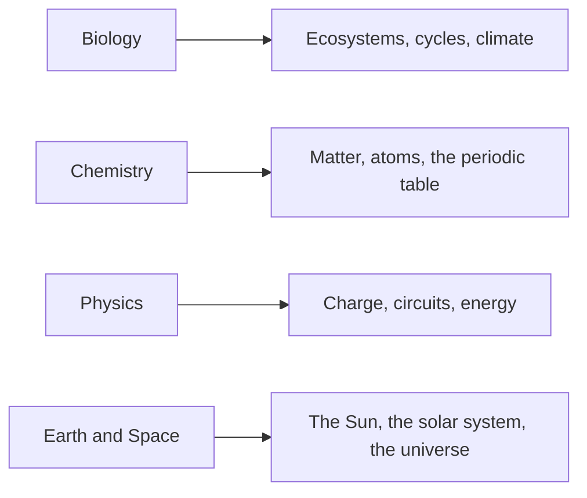

When we meet an idea for the first time, the explanation lands here — and stays
here. Class pages link to these; these do not go stale.

Start here when you are studying, when you missed a class, or when a lab makes
no sense.

> [!tip] Use the backlinks
> At the bottom of each concept page is a list of every class and lab that used
> it. That is the fastest way to find *when* we did something.
