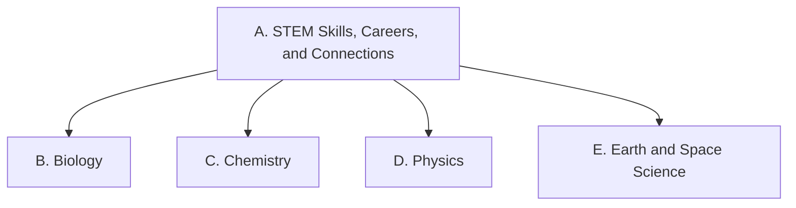

Everything we do in this course points at one or more of the Ontario curriculum
expectations for **SNC1W — Science, Grade 9, De-streamed**. Lesson pages link
here so you can always see *why* we are doing something.

The course has five strands. Strand A runs through all of the others: you
practise those skills while learning biology, chemistry, physics, and Earth and
space science.

## Strand A — STEM Skills, Careers, and Connections
- [[A1. STEM Investigation Skills]]
- [[A2. Applications, Careers, and Connections]]

## Strand B — Biology: Sustainable Ecosystems and Climate Change
- [[B1. Relating Science to Our Changing World]]
- [[B2. Investigating and Understanding Concepts]]

## Strand C — Chemistry: The Nature of Matter
- [[C1. Relating Science to Our Changing World]]
- [[C2. Investigating and Understanding Concepts]]

## Strand D — Physics: Principles and Applications of Electricity
- [[D1. Relating Science to Our Changing World]]
- [[D2. Investigating and Understanding Concepts]]

## Strand E — Earth and Space Science: Space Exploration
- [[E1. Relating Science to Our Changing World]]
- [[E2. Investigating and Understanding Concepts]]

---

> [!info] Where these come from
> The wording on these pages is the Ontario curriculum's own. See
> [[About These Expectations]].
