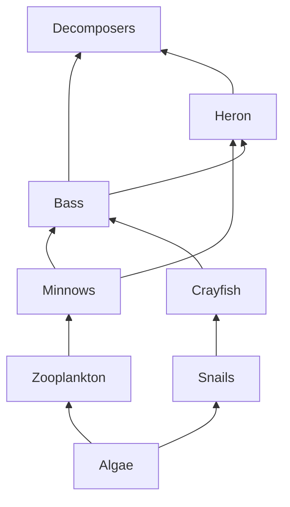

Use the web below for every question.

1. Name every producer.
2. Write one food chain with four links.
3. What trophic level are crayfish at? Explain why the answer is not simple.
4. A pesticide kills the zooplankton. Trace the effects on **each** other
   population and say whether it rises, falls, or is unaffected.
5. Which organism would cause the most disruption if removed? Defend your
   choice.
6. The arrows point from the eaten to the eater. Explain why that direction is
   the sensible one.

> [!question] Extension
> Bioaccumulation means a toxin becomes more concentrated at each level. Using
> the ten percent rule from [[Energy Flow in Ecosystems]], explain why the heron
> is at greatest risk.
