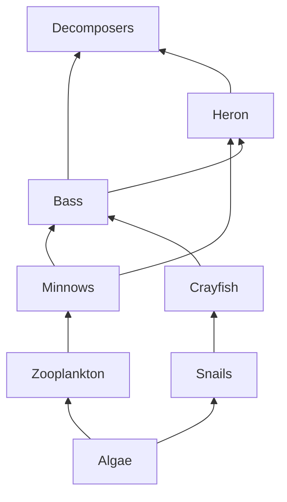

Use the web below for every question.

**1.** Name every producer.

> [!success]- Answer
> Algae, and only algae. It is the one organism here with no arrow pointing
> into it — nothing eats its way into existence; it makes its own food.

**2.** Write one food chain with four links.

> [!success]- Answer
> Algae → zooplankton → minnows → bass. Algae → snails → crayfish → bass also
> works. Any unbroken path following the arrows is fine.

**3.** What trophic level are crayfish at? Explain why the answer is not
simple.

> [!success]- Answer
> Third: algae (1) → snails (2) → crayfish (3).
>
> It is not simple because trophic level depends on the path you trace. Many
> organisms eat at several levels, so "level" is an average rather than an
> address. Bass are the clearest case here — reached by two different-length
> paths.

**4.** A pesticide kills the zooplankton. Trace the effect on every other
population.

> [!success]- Answer
> - **Algae** — rise at first; a grazer has been removed.
> - **Minnows** — fall; they lose a food source.
> - **Bass and heron** — fall; fewer minnows to eat.
> - **Snails** — may rise; less competition for algae.
> - **Crayfish** — may rise with the snails.
> - **Decomposers** — a brief rise as die-off arrives, then a fall.
>
> The point: something that never touched the heron can still reduce the heron.

**5.** Which organism would cause the most disruption if removed?

> [!success]- Answer
> Algae. Every other organism traces back to it, so removing it collapses the
> whole web. Among the animals, minnows are the strongest answer — they sit on
> the most paths between the bottom and the top.

**6.** Arrows point from the eaten to the eater. Why is that the sensible
direction?

> [!success]- Answer
> Because the arrow follows the **energy**, not the appetite. Energy moves out
> of the algae and into the zooplankton, so the arrow does too.

> [!question]- Extension: bioaccumulation
> A toxin becomes more concentrated at each level. Using the ten percent rule
> from [[Energy Flow in Ecosystems]], explain why the heron is most at risk.
>
> It takes roughly ten units of prey to build one unit of predator, and the
> toxin does not break down on the way. Every level multiplies the
> concentration by about ten, so the animal at the top carries the load of
> everything beneath it.
