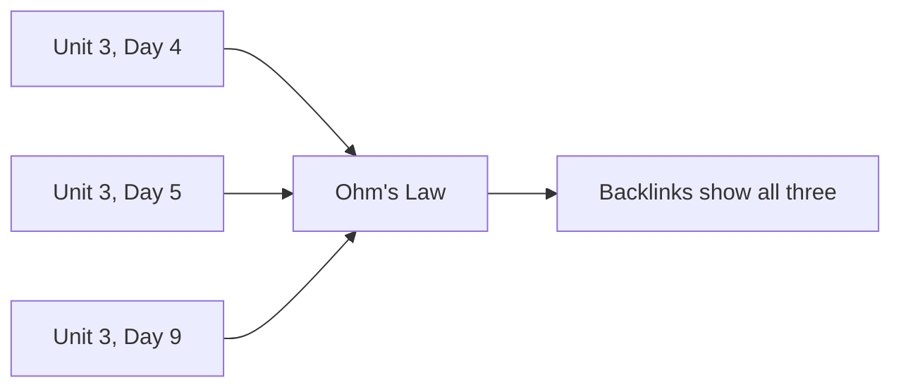

There are two kinds of page here, and knowing which is which makes the site
much easier to use.

## Class pages

Under **All Classes**, one page per class, in order. Each has:

- an **Agenda** — what we did, with links to everything we used
- **Things to do before our next class** — the homework, as a checklist

Class pages are the *narrative*: what happened, when.

## Reference pages

Everything else — Concepts, Investigations, Exercises, Tasks, Tutorials — is
*reference*. These pages are written once and linked from many class pages.

> [!tip] Which page do I want?
> **"What did we do Tuesday?"** → a class page.
> **"How does that work again?"** → a concept page.
> **"When did we cover this?"** → open the concept page and read its backlinks.

## Why not just put everything on the class page?

Because then the explanation of Ohm's law would exist in three places, and
fixing an error would mean fixing it three times. It would be fixed once and
wrong twice.

Each idea lives in exactly one page. Everything else links to it.
