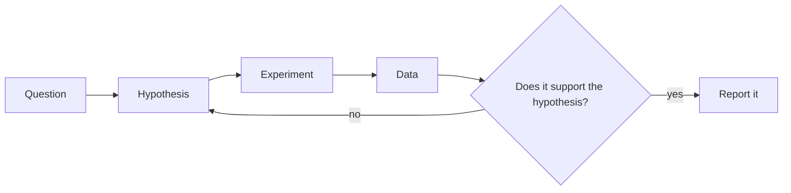
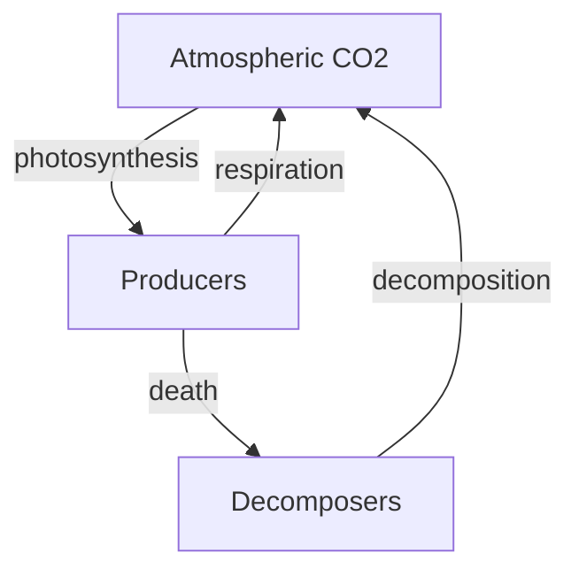
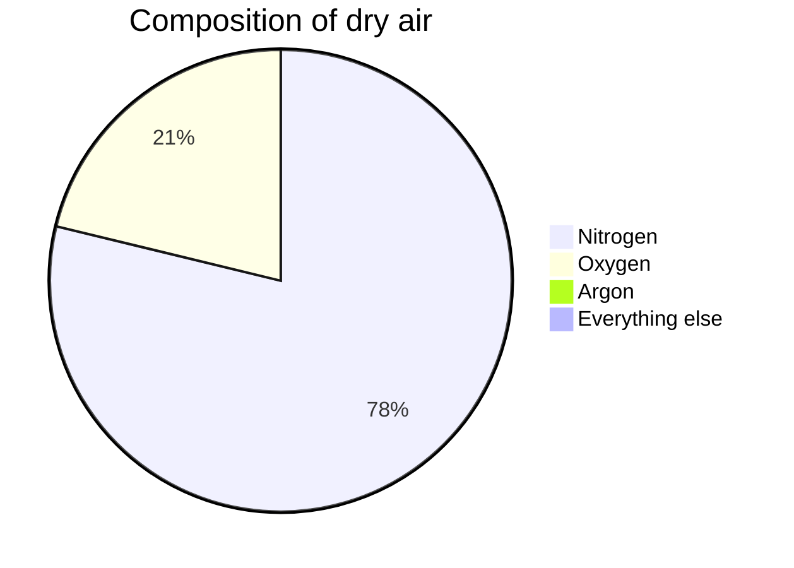
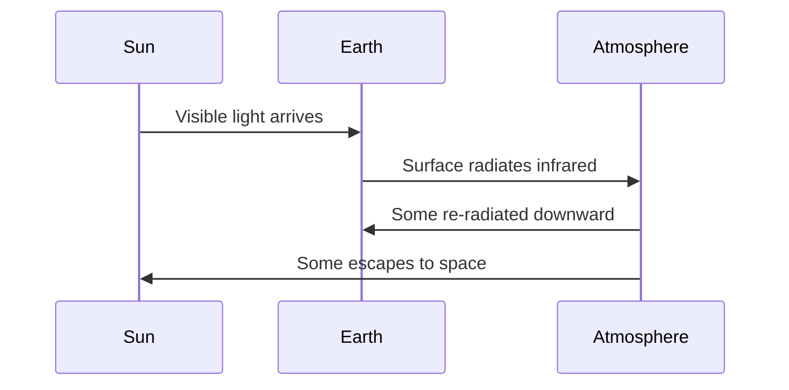
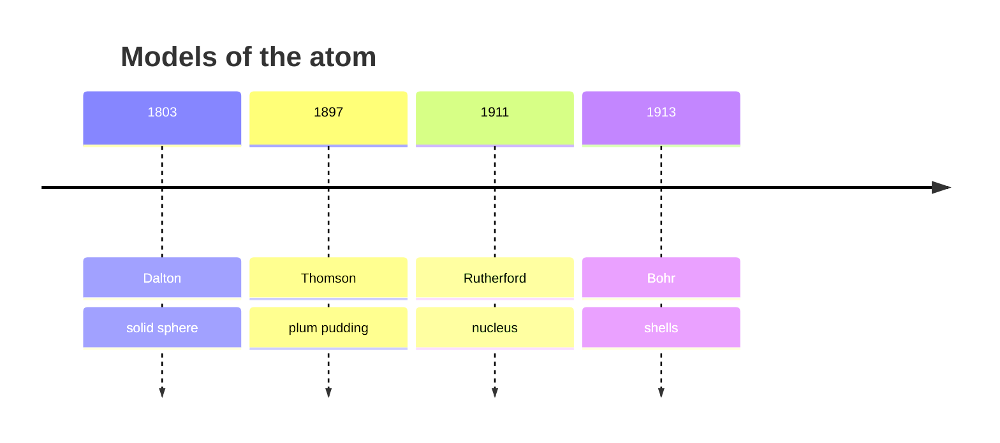

This page exists for two audiences. Students: it shows why the notes look the
way they do. Teachers: it is a working reference for everything you can put in a
page, with the source visible in every example.

Everything below is written in **Markdown** — plain text with a few marks of
punctuation that mean something. If you can write a text message, you can write
this.

---

## Text that carries meaning

You get **bold**, *italic*, ~~struck through~~, and ==highlighted== text.
Highlighting is the one worth knowing: it draws the eye better than bold when
you want a single ==key term== to stand out in a paragraph.

**How that was made:**

```markdown
**bold**, *italic*, ~~struck through~~, ==highlighted==
```

Arrows written as `->` become proper arrows: producers -> consumers ->
decomposers.

Keyboard keys look like keys: press <kbd>⌘</kbd> + <kbd>K</kbd> to search.

---

## Headings, and the table of contents

Every `##` heading on a page becomes a link in **Navigate this page**, over on
the right. Nothing builds that list by hand — it is made from the headings as
the page is built, so it can never fall out of step with the page.

Deeper headings nest underneath: a `###` sits inside the `##` above it, which
is why "Foldable callouts" appears indented under "Callouts".

**How that was made:** `##` at the start of a line, and `###` for a
sub-heading.

```markdown
## Callouts

### Foldable callouts
```

> [!tip] Write headings for the person skimming
> The table of contents is the first thing many students read. "Worked
> example" tells them what is there; "More on this" does not.

### Turning it off

A short page, or one that is mostly a list, reads better without a contents
panel. Add one line to the frontmatter:

```yaml
---
enableToc: false
---
```

Every class page in [[All Classes/index|All Classes]] uses this — an agenda of six items does not
need a navigation panel. So does
[[D2. Investigating and Understanding Concepts]]: open it and you will see no
"Navigate this page" on the right, because the page is a list of expectations
that is already its own index.

---

## Callouts

Callouts pull something out of the flow of the page. There are a dozen kinds and
each has its own colour and icon, so students learn to recognise them at a
glance.

> [!note] Note
> Neutral information worth setting apart.

> [!tip] Tip
> A shortcut, a habit, or something that makes the work easier.

> [!important] Important
> The one thing to take away if you take away nothing else.

> [!warning] Warning
> Where people usually go wrong.

> [!danger] Safety
> Used in this course only for physical safety in the lab.

> [!question] Question
> Something to think about rather than something to know.

> [!example] Example
> A worked case.

> [!abstract] At a glance
> Used at the top of assignment pages for due dates and format.

**How that was made:** a blockquote with the kind named in brackets.

```markdown
> [!warning] Where people usually go wrong
> The text of the callout goes here.
```

### Foldable callouts

Add a `-` to start a callout collapsed — useful for answers, hints, and solutions
you do not want a student to see immediately.

> [!success]- Answer to the practice question (click to expand)
> $I = \frac{V}{R} = \frac{12\ \mathrm{V}}{4.0\ \Omega} = 3.0\ \mathrm{A}$

**How that was made:** the `-` after the kind is the whole difference.

```markdown
> [!success]- Answer (click to expand)
> The hidden content.
```

---

## Mathematics

Inline maths sits in a sentence: the resistance is $R = 12\ \Omega$, giving a
current of $I = 0.50\ \mathrm{A}$.

Display maths gets its own line and is centred:

$$
\text{efficiency} = \frac{E_{\text{useful}}}{E_{\text{total}}} \times 100\%
$$

It handles anything a science course needs — fractions, subscripts,
superscripts, chemical formulas, and Greek:

$$
6\,\mathrm{CO_2} + 6\,\mathrm{H_2O} \xrightarrow{\ \text{light}\ } \mathrm{C_6H_{12}O_6} + 6\,\mathrm{O_2}
$$

$$
\rho = \frac{m}{V} \qquad E = mc^2 \qquad \Delta T = T_f - T_i
$$

**How that was made:** single dollar signs keep it in the sentence, double
ones give it a line of its own.

```markdown
Inline: $R = 12\ \Omega$

Display:
$$
\rho = \frac{m}{V}
$$
```

---

## Diagrams

Diagrams are **written, not drawn** — which means they can be edited in seconds
and never need a graphics program.

### Flowchart



**How that was made:** not a picture — these lines of text, between two fence
lines that say `mermaid`.

````markdown

````

`-->` draws an arrow, `["…"]` makes a box, `{"…"}` makes a decision diamond,
and `-->|yes|` labels the arrow. Change a word and the diagram redraws — no
graphics program, and the change shows up in a diff.

### Cycles



### Proportions



### Sequence



### Timeline



---

## Tables

**How that was made:** rows of text separated by `|`, with a line of dashes
under the headings.

| Quantity | Symbol | Unit | Instrument |
| --- | --- | --- | --- |
| Current | $I$ | ampere (A) | Ammeter |
| Potential difference | $V$ | volt (V) | Voltmeter |
| Resistance | $R$ | ohm ($\Omega$) | Ohmmeter |

Maths works inside table cells, which matters more than it sounds.

---

## Checklists

**How that was made:** a list where each line starts with `- [ ]`, or `- [x]`
for one already done.

- [ ] Goggles on
- [ ] Circuit checked by the teacher
- [x] Data table drawn before starting
- [ ] Station cleaned

They are clickable in the browser. Nothing is saved — but students find them
useful for keeping their place during a lab.

---

## Code

**How that was made:** three backticks and the name of the language, the code,
then three backticks to close it.

````markdown
```python
def resistance(voltage, current):
    return voltage / current
```
````

```python
def resistance(voltage, current):
    return voltage / current

print(resistance(12.0, 3.0), "ohms")
```

```javascript
const efficiency = (useful, total) => (useful / total) * 100
console.log(efficiency(60, 1200))
```

Syntax colouring follows the language you name after the opening fence, and
adapts to light or dark mode.

---

## Links between pages

This is what makes the site more than a pile of documents.

- A plain link: [[Ohm's Law]]
- A link with different words: [[Ohm's Law|the relationship between V, I, and R]]
- A link to a section: [[Ohm's Law#Worked example]]

**How that was made:** double square brackets.

```markdown
[[Ohm's Law]]
[[Ohm's Law|different words for the link]]
[[Ohm's Law#Worked example]]
```

### Transclusion — one page inside another

**How that was made:** `![[Page name]]` — a link with an exclamation mark in
front of it. Here is a curriculum expectation, embedded live rather than
copied:

![[D2.4]]

Change the source page and every page that embeds it updates. This is how each
class page shows the current expectation without anyone maintaining duplicates.

### Backlinks

Scroll to the bottom of any page and you will find **Backlinks** — every page
that links *to* this one, gathered automatically. Nobody maintains that list.
It is why linking generously costs nothing and pays off later.

---

## Hover previews

Hover over [[Photosynthesis]] without clicking. The page appears in a small
window. Students checking one definition mid-paragraph do not lose their place.

---

## Footnotes

**How that was made:** `[^1]` where the marker goes, and a matching `[^1]:`
line anywhere in the page.

Ontario's grid is unusually low-carbon compared with most of North America.[^1]

[^1]: Roughly 90% of Ontario's electricity comes from sources that emit little
    or no carbon dioxide while operating — mostly nuclear and hydroelectric.

---

## Tags

**How that was made:** a `tags` list in the frontmatter at the very top of the
page.

```yaml
---
tags:
  - biology
  - climate
---
```

Every tag becomes a page listing everything filed under it.

---

## What you cannot see

Two things on this page are invisible in the browser:

1. **Comments.** Text wrapped in `%%` double percent marks `%%` never reaches
   the site. Useful for notes to yourself in a page you are still writing.
2. **Drafts.** A page with `draft: true` in its frontmatter is skipped entirely
   when the site is built. Write next week's lesson today and publish it when
   you are ready.

%% This sentence is a comment. If you can read it on the website, something is broken. %%

> [!tip] For teachers reading this
> The per-section keys `draftSection1` and `draftSection2` let one shared page
> be published to one class and held back from another — useful when your two
> sections are a few days apart. Every Concepts page in this course uses them.

---

## The point of all this

None of it is decoration. Each feature removes a reason for a page to be out of
date:

| Feature | The problem it solves |
| --- | --- |
| Transclusion | The same text copied into six places, five of them stale |
| Backlinks | "Where did we use this again?" |
| Diagrams as text | Rebuilding a diagram from scratch to change one arrow |
| Drafts | Keeping unpublished work in a separate file somewhere |
| Maths | Screenshotting equations from a document |

Write it once, link to it everywhere.
