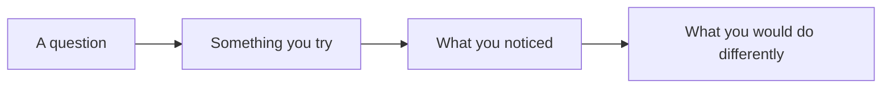
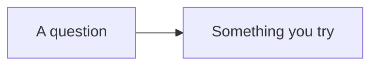

This page has two audiences. Students: it explains why the notes look the
way they do. Teachers: it is a working reference for everything you can put
in a page, with the source shown beside every example.

Everything below is written in **Markdown** — plain text with a few marks of
punctuation that mean something. If you can write a text message, you can
write this.

---

## Text that carries meaning

You get **bold**, *italic*, ~~struck through~~, and ==highlighted== text.
Highlighting is the one worth knowing: it catches the eye better than bold
when a single ==important phrase== has to stand out inside a paragraph.

**How that was made:**

```markdown
**bold**, *italic*, ~~struck through~~, ==highlighted==
```

Arrows written as `->` become proper arrows, and keyboard keys look like
keys: press <kbd>⌘</kbd> + <kbd>K</kbd> to search.

---

## Headings, and the table of contents

Every `##` heading becomes a link in **Navigate this page**, over on the
right. Nothing builds that list by hand — it is assembled from the headings
as the page is built, so it can never fall out of step with the page it
describes.

**How that was made:** `##` at the start of a line, and `###` for a
sub-heading.

### Turning it off

A short page reads better without a contents panel. One line in the
frontmatter does it:

```yaml
---
enableToc: false
---
```

Every class page in [[All Classes/index|All Classes]] uses this.

---

## Callouts

Callouts lift something out of the flow of the page. There are a dozen
kinds, each with its own colour and icon.

> [!note] Note
> Neutral information worth setting apart.

> [!tip] Tip
> A shortcut, a habit, or something that makes the work easier.

> [!important] Important
> The one thing to take away if you take away nothing else.

> [!warning] Warning
> Where people usually go wrong.

> [!example] Example
> A worked case.

**How that was made:** a blockquote with the kind named in brackets.

```markdown
> [!warning] Where people usually go wrong
> The text of the callout goes here.
```

### Foldable callouts

Add a `-` after the kind and the callout starts collapsed. Clicking the
title opens it. This is how answers and hints stay on the page without
giving themselves away.

> [!success]- Answer: click this line
> The hidden content sits here, out of sight until it is wanted.

```markdown
> [!success]- Answer: click this line
> The hidden content.
```

---

## Diagrams

Diagrams are **written, not drawn** — which means they can be edited in
seconds, they never need a graphics program, and a change to one shows up
in a diff.



**How that was made:** not a picture — those lines of text, between two
fence lines that say `mermaid`.

````markdown

````

---

## Tables

| Column | Column | Column |
| --- | --- | --- |
| Rows of text | separated by | vertical bars |
| with a line of | dashes under | the headings |

Maths works inside table cells, and so do links — which matters more than
it sounds, because a summary table can then be a navigation aid rather than
a dead end.

> [!note] For teachers: escape the pipe inside a table cell
> A wikilink with different display words uses a pipe, and so does the
> table. Inside a cell, write `[[Page\|the words shown]]` with a backslash,
> or the row splits into an extra column.

---

## Checklists

- [ ] A line that starts with `- [ ]`
- [x] One already done, written `- [x]`

On the site they are read-only — the boxes show what the page says, and
clicking one does nothing. Copied into a notebook, they are useful for
keeping your place.

---

## Links between pages

This is what makes the site more than a pile of documents.

- A plain link: [[How This Site Is Organised]]
- A link with different words:
  [[How This Site Is Organised|where everything lives]]

```markdown
[[How This Site Is Organised]]
[[How This Site Is Organised|different words for the link]]
```

### Transclusion — one page inside another

`![[Page name]]` pulls a whole page in live rather than copying it. Below,
the help-session times are pulled in:

![[Help Sessions]]

Change the source page and every page that embeds it updates. That is how
a section's landing page always shows the current class without anybody
maintaining a second copy of it.

### Backlinks

Scroll to the bottom of any page and you will find **Backlinks** — every
page that links *to* this one, gathered automatically. Nobody maintains
that list, which is why linking generously costs nothing.

---

## Hover previews

Hover over [[Using This Site]] without clicking. The page appears in a
small window, so checking one thing does not cost you your place.

---

## Footnotes

**How that was made:** `[^1]` where the marker goes, and a matching `[^1]:`
line anywhere in the page.[^1]

[^1]: Like this. Footnotes collect at the bottom no matter where you write
    them, so you can put the note next to the sentence it belongs to.

---

## Tags

```yaml
---
tags:
  - reference
  - setup
---
```

Every tag becomes a page listing everything filed under it.

---

## What you cannot see

Two things on this page are invisible in the browser:

1. **Comments.** Text wrapped in `%%` double percent marks `%%` never
   reaches the site. Useful for notes to yourself in a page you are still
   writing.
2. **Drafts.** A page with `draft: true` in its frontmatter is skipped
   entirely when the site is built. Write next week's lesson today and
   publish it when you are ready.

%% This sentence is a comment. If you can read it on the website,
something is broken. %%

> [!tip] For teachers reading this
> A shared page can be published to one section and held back from another
> using per-section `draftSection1` / `draftSection2` keys in the
> frontmatter — useful when two classes have drifted a few days apart.

---

## The point of all this

None of it is decoration. Each feature removes a reason for a page to go
out of date:

| Feature | The problem it solves |
| --- | --- |
| Transclusion | The same text copied into six places, five of them stale |
| Backlinks | "Where did we use this again?" |
| Diagrams as text | Rebuilding a whole diagram to change one arrow |
| Drafts | Keeping unpublished work in some other file somewhere |
| Hover previews | Losing your place to check one thing |

Write it once, link to it everywhere.
